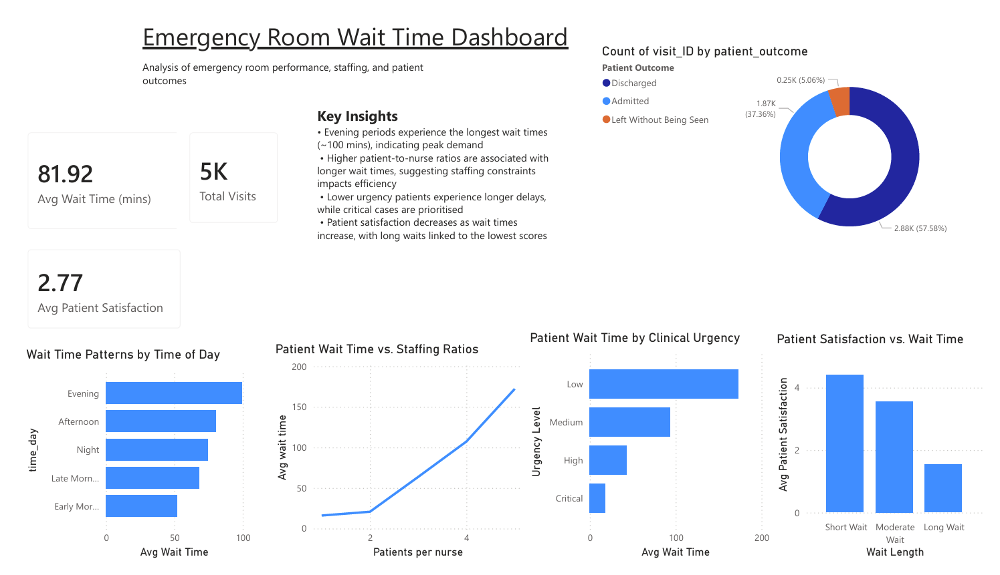

# Hospital Wait Time Analysis

## Project Overview

This project analyses emergency room operational performance using PostgreSQL and hospital wait time data sourced from Kaggle. The analysis focuses on identifying operational bottlenecks, congestion patterns, staffing impacts, patient satisfaction trends, and factors contributing to patients leaving without being seen.

The project was designed to simulate a real-world healthcare operations analysis workflow, beginning with data cleaning and validation before progressing into business-focused SQL analysis.

---

## Tools Used

* PostgreSQL
* pgAdmin 4
* SQL
* Power BI (dashboard visualisation)

---

## Dataset

The dataset contains simulated emergency room visit records, including:

* Patient visit information
* Hospital identifiers
* Wait time stages
* Staffing levels
* Patient outcomes
* Satisfaction ratings
* Seasonal and time-based visit patterns

Key columns analysed include:

* `total_wait_time`
* `urgency_level`
* `nurse_patient_ratio`
* `patient_satisfaction`
* `patient_outcome`
* `time_to_registration_min`
* `time_to_triage_min`
* `time_to_medical_professional`

---

## Data Cleaning & Validation

Before analysis, the dataset was validated and cleaned using SQL.

Cleaning steps included:

* Resolving timestamp import compatibility issues
* Verifying successful data import
* Checking for NULL values in key analytical columns
* Identifying duplicate visit IDs
* Checking for impossible negative wait times
* Validating consistency of urgency level categories

---

## Business Questions

The project investigates the following operational questions:

1. Which hospitals have the highest average wait times?
2. Which time periods experience the greatest congestion?
3. Do staffing levels reduce wait times?
4. Does urgency level impact wait time appropriately?
5. At what point does patient satisfaction decline?
6. Which stage of the patient journey creates the biggest bottleneck?
7. Do longer wait times increase the likelihood of patients leaving without being seen?

---

## Key Insights

### Operational Congestion

* Evening periods and Mondays experienced the highest operational congestion.
* Winter recorded the highest average wait times despite not having the highest patient volume.

### Staffing Efficiency

* Higher nurse-to-patient ratios were strongly associated with shorter average wait times.
* Results suggested staffing levels play a major role in operational efficiency.

### Urgency Prioritisation

* Higher urgency patients experienced shorter wait times, indicating effective prioritisation.
* Lower urgency patients experienced substantially longer delays.

### Patient Satisfaction

* Patient satisfaction declined significantly as total wait times increased.
* Long waits were consistently associated with lower satisfaction ratings.

### Operational Bottlenecks

* Waiting to see a medical professional accounted for over 55% of total patient wait time.
* Physician availability appeared to be the largest operational bottleneck.

### Patient Abandonment Risk

* Patients who left without being seen experienced substantially longer average wait times.
* Although only approximately 5% of patients left without being seen, the significantly longer delays suggest an important operational risk area.

---

## SQL Concepts Demonstrated

This project demonstrates the use of:

* Aggregations (`AVG`, `COUNT`)
* Window functions
* Common Table Expressions (CTEs)
* `CASE WHEN` logic
* Data validation queries
* Grouping and ordering
* Percentage calculations
* Business KPI analysis

---

## Project Files

| File                              | Description                    |
| --------------------------------- | ------------------------------ |
| `hospital_wait_time_analysis.sql` | Full SQL workflow and analysis |
| `README.md`                       | Project documentation          |
| `dashboard.pbix`                  | Power BI dashboard file        |

---

## Dashboard

A Power BI dashboard was created to visualise:

* Emergency room congestion patterns
* Staffing impact on wait times
* Patient satisfaction trends
* Operational bottlenecks
* Patient outcomes

## 📊 Dashboard

---

## Overall Conclusion

The analysis identified several operational factors contributing to prolonged emergency room wait times. Congestion patterns, staffing levels, and physician availability all showed strong relationships with patient wait duration and satisfaction outcomes.

The findings suggest that improving staffing allocation and reducing delays before patients see a medical professional could significantly improve operational efficiency and patient experience.

---

## Author

Created as part of a data analytics portfolio project using PostgreSQL and Power BI.
